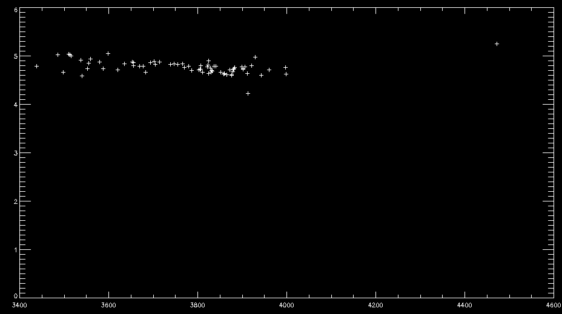

# Stage1:程序测试
- [x] 预处理：将table_b16中的光谱designation，转换成赤道(degree,degree)坐标。
- [x] 下载数据：从LAMOST DR3 中下载table_b16中的光谱
- [x] 筛选：选择信噪比snri、snrr 高的数据（排除坏点）
- [x] 保存文件：包含文件路径和snrr，以便table_b16_1.pro可以检索到 

## 编译运行/Test/fit_b16_1.pro
```idl
IDL> cd, $indep
IDL> .compile fit_b16_1-c.pro
% Compiled module: FIT_B16_1.
```
## Fix Bugs
### 未找到星表文件
```idl
IDL> fit_b16_1
% Attempt to call undefined procedure/function: 'CGERRORMSG'.
% Execution halted at: READCOL           177 /usr/local/exelis/idl82/lib/pro/misc/readc
  ol.pro
%                      FIT_B16_1          30 /usr/local/ulyss/pgm/indep/fit_b16_1-c.pro
%                      $MAIN$       
```

从星表中分别读入:  DESIG、 spt 、 Teff 、 Zeta 、 Fe/H 、 Volein

```idl
path    = '/usr/local/ulyss/pgm/indep/'
```

### 无法登录数据库
```idl
IDL> fit_b16_1
% Attempt to call undefined procedure/function: 'OPENMYSQL_PP'.
% Execution halted at: FIT_B16_1          53 /usr/local/ulyss/pgm/indep/fit_b16_1-c.pro
%                      $MAIN$   
```
1. 文本处理：从星表table_b16中读取DESIG，存放于/Test/Data_Download/table_b16/Desig_names.txt
2. DESIG是天体的时角Hourangle，使用/Test/Pre-processing/HourAngle2Angle.ipynb将时角转换成角度，存放于/Test/Data_Download/DR3_table_b16/coords_Angle.txt
3. 数据下载：在LAMOST DR3中，使用coords_Angle.txt角度检索，下载2"内匹配的光谱fits文件，存放于/Test/Data_Download/table_b16。下载星表数据/Test/Data_Download/DR3_table_b16/496340.csv
4. 496340.csv的分隔符是'|'，需要改成',' 。以便TopCat识别
5. 筛选星表：使用TopCat读取table_b16_2.csv，筛选R、i波段信噪比snrr、snri>10的文件保留，提高可靠性。
6. 删除掉检索编号相同的文件，保留信噪比高的。保存为/Test/Pre-processing/table_b16_2.csv
7. 文本处理：使用/Test/Pre-processing/csv2text.ipynb将table_b16_2.csv中的DESIG、SNRR、Spec_path保存在/Test/Pre-processing/DataBase_b16.txt中
8. 更新星表：csv2text.ipynb将table_b16与筛选后的DataBase_b16.txt对比，保留72个相同DESIG的目标，存放于/Test/Pre-processing/table_b16_modified

### Fit完成，无图像输出



+ 存在11条光谱是invalid，其余fit完成。
```idl
IDL> fit_b16_1
% READCOL: 72 valid lines read
...
3 J004613.83+335010.3 /usr/local/ulyss/pgm/indep/files/spec-55911-M31_007N34_B2_sp05-222.fits
    0.0032770634
4 J005242.36+315545.1 /usr/local/ulyss/pgm/indep/files/spec-56647-M31010N33M1_sp07-126.fits
    0.0034291744
-> No valid input fits file.
   4.1007996e-05
...
-> valid final out num:           53out of           72
-> Bad fits file num:        0
-> Finish fit_b16_1
```

### question
1. 物理量是什么(单位？)
```idl
readcol, infile, designation, spt, teffin, zeta, fehin, veloin,format='A,F,F,F,F,F'
```
+ spt :
+ zeta : Fe/H (dex)
+ veloin : 视向速度RV

2. 拟合失败（list 5 为例）

   + 输入的地址没有检索到。
   + DataBase_b16中数据格式不一致。snrr应为4个字符，若只有三位则导致后续文件名读取出错。文件读写程序不够鲁棒。
   + ~~解决：把三位、五位的snrr手动添加到4位（补0）~~
   + 修正：fit_b16_1.pro 中的从文件中读取字符串的部分。
   
```idl
-> valid final out num:           63out of           72
-> Bad fits file num:        0
```
为什么还有9条 invalid final out？ 结果拟合的不好？
+ 截取第70条光谱（invalid out）
```idl
ulyss:      0.50930619
      0.51259208
70 J225612.76+061236.3 /usr/local/ulyss/pgm/indep/files/spec-56600-EG230400N063658M01_sp10-010.fits
--------------------------------------------------------------------
INPUT PARAMETERS
--------------------------------------------------------------------
Name of the output file              /usr/local/ulyss/pgm/indep/res_nc_b16_1/spec-56600-EG230400N063658M01_sp10-010.res
Degree of multiplicative polynomial        15
No additive polynomial  
Component1 (cmp70) model:/usr/local/ulyss/pgm/indep/mod/miles_tgm2.fits 
  Guess for Teff: 3500.0000 [K], Logg: 2.0000000 4.0000000 [cm/s2], Fe/H: -0.50000000 [dex]
--------------------------------------------------------------------
--------------------------------------------------------------------
PARAMETERS PASSED TO ULY_FIT
--------------------------------------------------------------------
Wavelength range used                 :       3999.4475       7302.9781 [Angstrom]
Sampling in log wavelength            :       69.029764 [km/s]
Number of independent pixels in signal:        2615
Number of pixels fitted               :        2615
DOF factor                            :      1.00000
--------------------------------------------------------------------
Perform global optimization, number of nodes:           2
number of model evaluations:          45
node:           0 chi2:        20.373701
number of model evaluations:          45
node:           1 chi2:        20.373717
time=      0.49040580
Number of pixels used for the fit        2588

cz             :       3.4266088 +/- 3.2264213 km/s
dispersion     :       42.945573 +/- 4.0725256 km/s
-----------------------------------------------
estimated SNR  :       13.534829
-----------------------------------------------
cmp #0  cmp70
Weight         :       65.588218 +/-      0.018615133 [data_unit/cmp_unit]
Teff           :       3537.2655 +/- 7.2021575 K
Logg           :       4.9076035 +/- 0.021355359 cm/s2
Fe/H           :      -1.4611790 +/- 0.045085786 dex
-----------------------------------------------
```

3. 拟合之后，画图失败

+ stop : 在该位置断点。在交互界面输入 .c 即可继续运行 （方便查看变量）
+ plot参数设置 : 
```idl
plot,alog10(outout(0,tmp)),outout(1,tmp), xtitle='log(Teff)', $
	xr=xr1,xstyle=xstyle, xthick=xthick, ytickin=1, xtickin=0.1, $
      xmargin=[12,2], yr=yr1, ythick=ythick, ystyle=ystyle, ymargin=[3.5,1], $
      xticklen=0.025, yticklen=0.015, charsize=charsize, ytitle='log g', $
      charthick=charthick, /nodata, thick=thick, xminor=2, yminor=2, BACKGROUND = grey
oplot, alog10(outout(0,tmp)),outout(1,tmp), psym=psym, symsize=symsize, color= black
;oplot, (alog10(para(3,*)))(tm3), (para(5,*))(tm3), psym=psym, symsize=symsize, color= blue
stop
```
4. table_b16_1_out文件的含义（以J003010.59+400741.0  spec-56266-M31007N41B1_sp05-090为例）

| snrr  | snr   | T      | T_err | G    | G_err | M     | M_err | RV   | RV_err | sigma | sig_err |
| ----- | ----- | ------ | ----- | ---- | ----- | ----- | ----- | ---- | ------ | ----- | ------- |
| 35.05 | 22.24 | 3653.0 | 34.3  | 4.87 | 0.07  | -0.95 | 0.15  | 17.5 | 10.2   | 51.5  | 14.1    |

5. outout 变量的含义 ( $9\times$ num_stars 二维数组)

| 0    | 1    | 2    | 3    | 4       | 5       | 6       | 7        | 8    |
| ---- | ---- | ---- | ---- | ------- | ------- | ------- | -------- | ---- |
| T    | G    | M    | RV   | T_err_c | G_err_c | M_err_c | RV_err_c | snr  |

   

# Stage2:制作星表，交叉验证
- [ ] 下载数据：从lamost下载数据，按照正式名称筛选，下载fits，保存成csv--> 得到星表：（包含名称、属性数据，可以筛选信息）
- [ ] 首先制作星表：与其他的已知参数的星表比对，这样得到的数据是已知结果的，自己做出的结果可以得到验证
- [ ] 第二步：通过筛选后的星表，再结合新的筛选信息（如：信噪比>100）再挑选一次（pandas read csv）。最后下载里面的fits光谱数据。
- [ ] 最后，把下载的光谱输入到程序中得到参数
- [ ] 保存，输出结果
