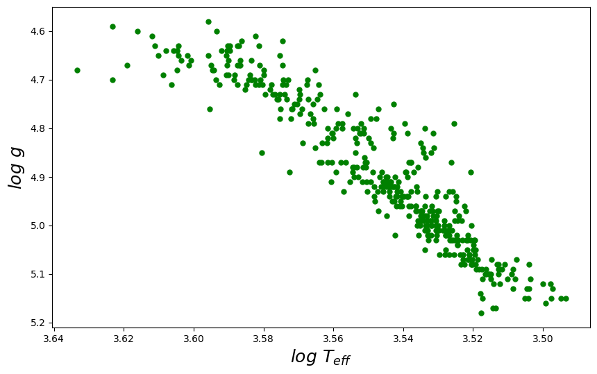
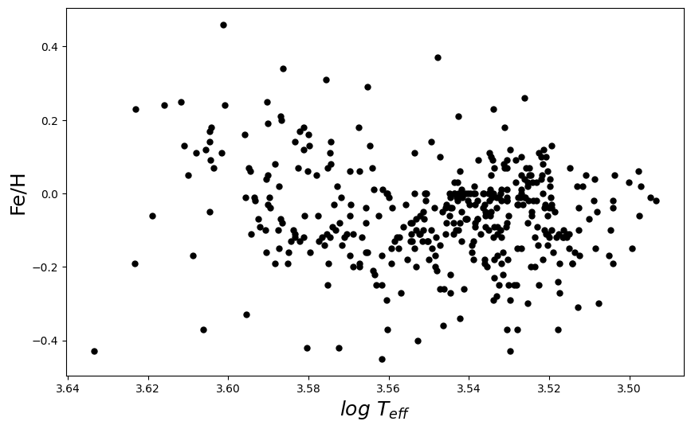
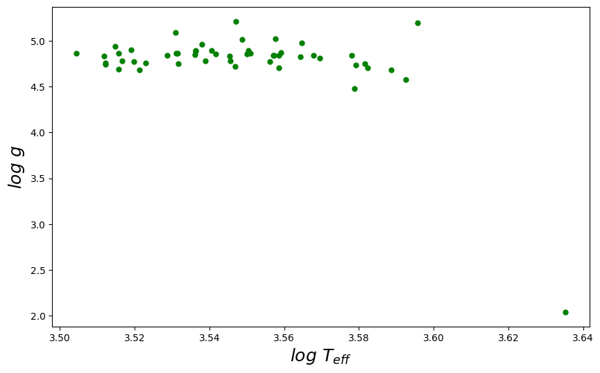
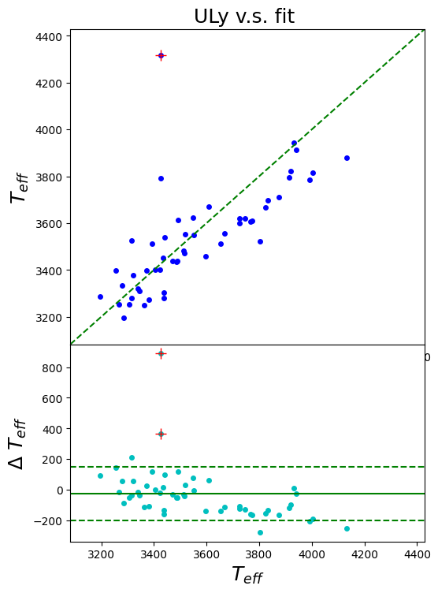
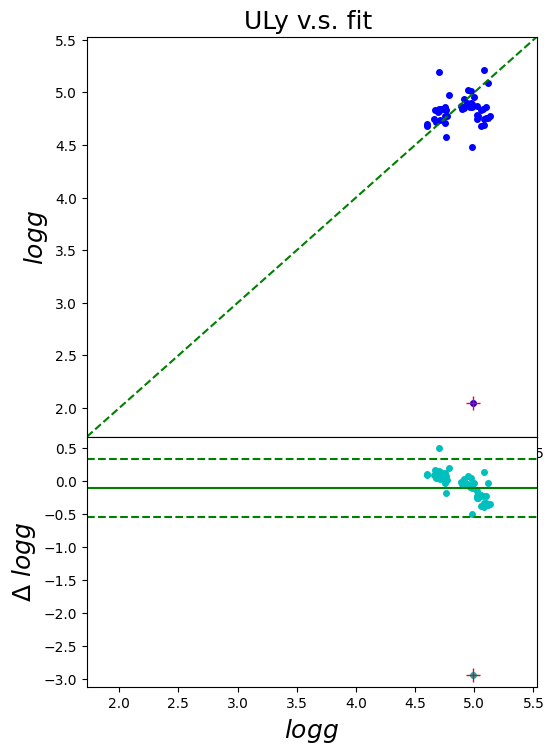
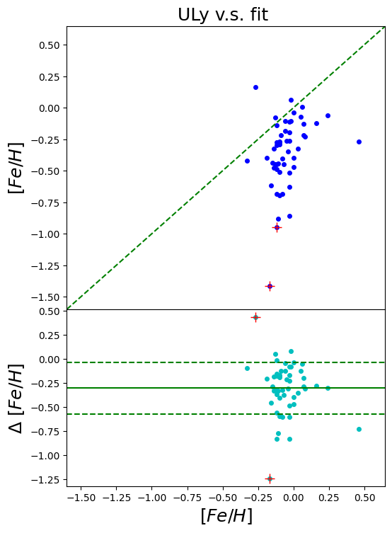

# Stage2 :  共同源验证

- [ ] 筛选出已做参数的M 型星, 验证 ULySS_M 的结果 

## 数据来源
1. 光谱库

 **SIMBAD** 

- [x] STELIB [Le Borgne et al. 2003](Le Borgne J.-F. et al., 2003, A&A, 402, 433)    249 个 恒星光谱库。 R ~ 2000

- [x] ELODIE 3.2 [Prugniel](Prugniel, P., & Soubiran, C. 2001, A&A, 369, 1048)

- [x] CFLIB  [Valdes 2004](Valdes, F., Gupta, R., Rose, J. A., Singh, H. P., & Bell, D. J. 2004, ApJS, 152, 251) 

- [x] MILES [Sanchez 2006](Sánchez-Blázquez, P., Peletier, R. F., Jiménez-Vicente, J., et al. 2006, MNRAS, 371, 703)  [Cenarro 2007](Cenarro, A. J., Peletier, R. F., Sánchez-Blázquez, P., et al. 2007, MNRAS, 374, 664)   [Falc´on-Barroso et al. 2011](Falc´on-Barroso J., S´anchez-Bl´azquez P., Vazdekis A., Ricciardelli E., Cardiel N., Cenarro A. J., Gorgas J., Peletier R. F., 2011, A&A, 532, A95)

- [x] [TGMET](Soubiran, C., Bienaymé, O., Mishenina, T. V., & Kovtyukh, V. V. 2008, A&A, 480, 91) （很少的M星）

- [x] LEMONY [Wang C. 2018](Wang C. et al.(2018)MNRAS)  : 新编的 MILES

- [ ] NGSL [Heap & Lindler 2007](Heap S. R., Lindler D. J., 2007, in Vallenari A., Tantalo R., Portinari L., Moretti A., eds, ASP Conf. Ser. Vol. 374, From Stars to Galaxies: Building the Pieces to BuildUp theUniverse, Astron. Soc. Pac., San Francisco, p. 409)

- [ ] XSL [Chen et al. 2014](Chen Y-P., Trager S. C., Peletier R. F., Lancon A., Vazdekis A., Prugniel P., Silva D. R., Gonneau A., 2014, A&A, 565, A117)

- [ ] Extended IRTF Library [Villaume et al. 2017](Villaume A., et al., 2017, ApJS, 230, 23)   红外波段  284 个恒星，同样位于MILES 中，构建了内插器 SPI ，扩展到冷矮星和冷贫金属星。

- [ ] MIUSCAT [Vazdekis et al. 2012](Vazdekis A., Ricciardelli E., Cenarro A. J., Rivero-Gonz´alez J. G., D´ıaz-Garc´ıa L. A., Falc´on-Barroso J., 2012, MNRAS, 424, 157)

- [ ] CaT [Cenarro et al. 2001](Cenarro A. J., Cardiel N., Gorgas J., Peletier R. F., Vazdekis A., Prada F., 2001, MNRAS, 326, 959)

- [ ] PASTEL [Soubiran C. 2010](Soubiran C., Le Campion J.-F., Cayrel de Strobel G., Caillo A., 2010, A&A, 515, A111)

- [ ] BT-Settl 模板生成光谱？

2. 巡天项目

- [x] SDSS - SEGUE / APOGEE - ASPCAP 
- [x] LAMOST DR7 : M 星表
- [ ] GAIA 

3. 文献汇编

- [x] LEPINE S. et al.(2013)AJ   : 给出了 TG 参数（由 PHONIX 拟合）

- [x] [SpecMatch-Emp](Yee S.W. et al.(2017)ApJ )   :  筛选了M 星之后 76， 对应LAMOST 中数据：4

- [ ] [Cayrel 2001](Cayrel de Strobel, G., Soubiran, C., & Ralite, N. 2001, A&A, 373, 159)

- [ ] [Takada 1977](Takada, M. 1977, PASJ, 29, 439) : O星， LTE

- [ ] [Takeda 2007](Takeda, Y. 2007, PASJ, 59, 335) : Post-AGB 的衰变元素，NLTE

- [ ] [Luck 1980](Luck, R. E., & Bond, H. E. 1980, ApJ, 241, 218) :  少量的晚型星 

- [ ] [L´epine 2007](L´epine, S., Rich, R. M., & Shara, M. M. 2007, ApJ, 669, 1235)

- [ ] ~~Lepine S et al.(2011)AJ~~ ： 只列出了光谱亚型

## 交叉验证

- [ ] 挑选对应的 LAMOST DR7 中 M 星的光谱，拟合参数

### 数据准备

| CFLIB          | ELODIE  | LEPINE S. et al.(2013)AJ | MILES_1         | MILES_2         | STELIB  | TGMET        |
| -------------- | ------- | ------------------------ | --------------- | --------------- | ------- | ------------ |
| J/ApJS/152/251 | III/218 | J/AJ/145/102             | J/MNRAS/371/703 | J/MNRAS/374/664 | III/232 | J/A+A/480/91 |

| 来源                                          | 原表 | 筛选后 | LAMOST检索 | 备注                      |
| --------------------------------------------- | ---- | ------ | ---------- | ------------------------- |
| [Pass2018]( V. M. Passegger et al.(2018)A&A ) | 300  | 228    | 33         | 原文给出的 ra.icrs 不准确 |
| [Schw2019]( A. Schweitzer et al.(2019)A&A )   | 293  | 214    | 31         | 19个Pass2018中的共同源    |
| [Mald2020]( J. Maldonado et al.(2020)A&A )    | 204  | 201    | 17         | Fe_H 有缺失               |
| [SpecMatch](Yee S.W. et al.(2017)ApJ)         | 404  | 59     | 3          | 不含SpType                |

+ 参数空间分布

### 拟合结果

+ 参数空间

  

+ Teff vs ref

  

  高温时(Teff > 3600 K)，拟合的温度偏低

  

+ log g vs ref

  

+ Fe_H vs ref

  

  Fe_H 的误差大，偏差大
  
### 离群点，误差较大：

| index | lamost | snr  | RA   | DEC  | snrr | Teff | Teff_err | logg | logg_err | Fe_H | Fe_H_err | RV   | RV_err | sigma | sig_err | Name | Teff_ref | logg_ref | Fe_H_ref | ref_name |
| ----- | ------ | ---- | ---- | ---- | ---- | ---- | -------- | ---- | -------- | ---- | -------- | ---- | ------ | ----- | ------- | ---- | -------- | -------- | -------- | -------- |
|9|J005702.84+450509.7|13.6760187|14.2618551|45.0860329|58.1800003|4317.5126953|94.5243912|2.0434593999999997|0.3978953|-0.10572809999999999|0.152626|101.3841171|7.9783974|46.8194466|13.897017499999999|G 172-030|3426.0|4.989999771118164|-0.059999998658895486|J/A+A/625/A68/tableb1|
|38|J094355.56+265808.3|5.2691417000000005|145.9815063|26.968975099999998|11.409999800000001|3792.2155761999993|95.5911255|4.4773445|0.21805120000000003|0.0622561|0.2696783|186.0885162|146.5243835|621.6463623|149.6156006|GJ 3564|3427.0|4.980000019073486|-0.019999999552965164|J/A+A/625/A68/tableb1|
|1|J020228.24+103453.4|4.7900127999999995|30.617683399999997|10.5815201|40.840000200000006|3396.4416504|15.7593451|5.0884347000000005|0.044195599999999995|-1.4114538|0.1879193|112.67180630000001|19.8447342|90.65647890000001|23.7909088|RX J0202.4+1034|3254.0|5.119999885559082|-0.17000000178813934|J/A+A/615/A6/tablea1|
|24|J121539.36+523908.7|8.7695446|183.91403200000002|52.6524353|205.08000180000002|3321.9160156|19.1854935|4.6789322|0.0600553|-0.9503709000000001|0.1708915|75.9663391|15.5667791|90.96507259999998|18.255310100000003|StKM 2-809|3339.0|5.059999942779541|-0.119999997317791|J/A+A/625/A68/tableb1|
|25|J162525.00+541814.5|5.1601805999999995|246.3526611|54.304122899999996|524.7800293|3471.9357909999994|32.053833000000004|4.8896441|0.06027090000000001|0.1639906|0.16314779999999998|63.7403069|16.674699800000003|59.273922|21.064445499999998|GJ 625|3516.0|4.980000019073486|-0.2700000107288361|J/A+A/615/A6/tablea1|

## 数据分析

1. 高分辨验证
+ 将高分辨光谱 （如： CFLIB 的某谱线）降低到 LAMOST 分辨率，用 ULM 得到参数， 并与其高分辨率下的参数对比。
+ 用于证明由于低分辨率，ULySS 的效果降低了多少。LAMOST 低分辨不会太大影响结果
+ 同时，拟合高分辨率的 光谱/模板光谱，并于文献/Pipeline 给出的参数 做比较

2. 信噪比验证
+ 使用不同的 SNR 区间，验证低、中、高 SNR 对 ULySS 效果的影响
+ 10~20， 20~30， >30 ，随机选择， 每个 bin 中样本数均匀